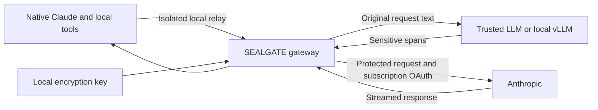

# sealgate

**[Read the website and getting-started guide →](https://madeye.github.io/sealgate/)**

Encrypt sensitive text before Claude Code sends it remotely. `sealgate claude` keeps
Claude's native terminal interface and subscription login, with a local gateway
that inspects complete model requests and an OS sandbox (the macOS sandbox, or
Docker on Linux). Linux tools have direct network access outside SEALGATE;
macOS blocks other network traffic by default. Your configured **trusted detection provider**, such as local
vLLM, identifies sensitive spans; Node encrypts them with a local AES-256-GCM key.

For narrower workflows, `sealgate protect` prints a protected prompt for pasting and
`sealgate chat` offers a prompt-only terminal wrapper. The companion plugin supplies
a reminder; it cannot intercept requests by itself.

This is conventional authenticated encryption, **not homomorphic inference**.
Claude can use the surrounding text but cannot understand encrypted values.



See the [gateway guide](docs/gateway.md) for the native launcher and network
boundary, [how it works](docs/how-it-works.md) for the detection, encryption, and
decryption steps, and [the security model](docs/security.md) for trust boundaries
and limitations. The instructions below cover installation and configuration.

## Install

Requires Node.js 22 or later. The enforced `sealgate claude` launcher additionally
requires the native `claude` binary on PATH and either macOS (ARM64 or x86-64,
using the built-in `sandbox-exec` sandbox) or Linux ARM64/x86-64 with a local
Docker daemon. Manual preprocessing and the older chat wrapper also work on WSL.
The project is written in
TypeScript and compiles to Node.js ES modules in `dist/`. TypeScript and Node type
definitions are development dependencies; the installed CLI has no runtime npm
dependencies. From this checkout:

```sh
git clone https://github.com/madeye/sealgate.git
cd sealgate
npm ci
npm install --global .
sealgate --help
claude --plugin-dir /absolute/path/to/sealgate
```

`npm ci` installs the locked development dependencies and builds the project.
You can also use `node /absolute/path/to/sealgate/dist/bin/sealgate.js` after building,
without installing the CLI. The plugin is loaded for Claude sessions launched
with `--plugin-dir`; its hook also runs compiled code from `dist/`.
Installing the npm CLI alone does not enable the Claude plugin. See Claude's
[plugin reference](https://code.claude.com/docs/en/plugins-reference) for loading
and distributing plugins.

## Configure a trusted provider

Choose a provider that you trust to receive the full original prompt. It must
support the OpenAI-compatible `POST /chat/completions` API and JSON object output.
There is no default remote provider or fallback.

```sh
sealgate init --base-url https://your-trusted-provider.example/v1 --model your-detector-model
```

The `.example` URL is a placeholder; substitute your actual trusted service.
Initialize with a model identifier supported by that service. Supply its API key
through the `SEALGATE_API_KEY` environment variable, preferably using a secret manager.
For an interactive Bash session, this avoids placing the key in shell history:

```sh
read -rsp 'Trusted provider API key: ' SEALGATE_API_KEY
export SEALGATE_API_KEY
printf '\n'
```

To use another environment variable, pass `--api-key-env PRIVATE_LLM_API_KEY` to
`init`. Use `--no-api-key` for an explicitly unauthenticated provider, for example:

```sh
sealgate init --base-url http://127.0.0.1:8000/v1 --model local-detector --no-api-key
```

HTTPS is required except for plain HTTP to loopback (`localhost`, `127.0.0.0/8`, or
`::1`) or to a literal private LAN address (`10.0.0.0/8`, `172.16.0.0/12`,
`192.168.0.0/16`, or IPv6 `fc00::/7`), for example a vLLM host on your home network:

```sh
sealgate init --base-url http://192.168.0.4:8080/v1 --model qwen3.8-27b
```

Hostnames other than `localhost` always require HTTPS, since a name can resolve to
any address. Plain HTTP on a LAN is readable by anyone on that network segment, so
use it only on a network you control.
URL credentials, query strings, fragments, and HTTP redirects are rejected.
The base path is preserved and `/chat/completions` appended, so include `/v1` if
your provider requires it. HTTP errors, refusals, truncated responses, unsupported
JSON mode, and malformed answers fail without printing a protected prompt.

Initialization creates these files outside Git repositories:

- `~/.config/sealgate/config.json`: provider and detection settings, mode `600`.
- `~/.config/sealgate/key`: 32 random binary bytes, mode `600`.
- The containing `sealgate` directory has mode `700`.

`XDG_CONFIG_HOME` changes the configuration parent; `SEALGATE_CONFIG_DIR` overrides the
whole directory. Both must be absolute paths. Keep it outside source repositories
and shared directories. Unsafe permissions, linked storage files, and a symlink
for the `sealgate` directory are rejected. Native Windows permissions are unsupported;
use WSL and its Linux filesystem.

Edit the private `config.json` to change settings. Its complete schema is:

```json
{
  "version": 1,
  "baseUrl": "https://your-trusted-provider.example/v1",
  "model": "your-detector-model",
  "apiKeyEnv": "SEALGATE_API_KEY",
  "timeoutMs": 30000,
  "detectionInstructions": "Detect credentials, personal identifiers, contact details, financial information, and explicitly marked confidential content.",
  "additionalCategories": ["Unreleased project names", "Internal customer identifiers"],
  "sandboxReadPaths": ["/Users/you/.cargo", "/Users/you/.rustup"]
}
```

`init` writes more detailed default detection instructions covering those five
categories. `additionalCategories` extends them; editing `detectionInstructions`
replaces the category instructions. Use `apiKeyEnv: null` for no Authorization
header. Never place an API key itself in this file. The timeout is an integer from
1 to 300000 milliseconds and covers the entire HTTP response; set its initial
value with `--timeout-ms`. The optional `sandboxReadPaths` lists up to 32 absolute
host paths that the macOS sandbox may read (never write); it is how toolchains
installed under your home directory, such as `~/.cargo` or `~/.nvm`, become
available to Claude's tools, and each entry's `bin` directory joins the sandbox
PATH. Entries may not be your home directory, the key directory, or `~/.claude`.
Unknown configuration fields are rejected.

### Local vLLM with `.env`

`sealgate protect`, `sealgate chat`, and `sealgate claude` read `.env` from your current working directory. For a local
vLLM gateway, use the following settings (substitute your served model and key):

```dotenv
SEALGATE_BASE_URL=http://127.0.0.1:8080/v1
SEALGATE_MODEL=qwen3.8-27b
SEALGATE_API_KEY_ENV=SEALGATE_API_KEY
SEALGATE_API_KEY=your-local-gateway-key
SEALGATE_TIMEOUT_MS=120000
SEALGATE_ENABLE_THINKING=false
```

Set file permissions with `chmod 600 .env`. This repository ignores `.env` files
and excludes them from the npm package. Run `sealgate protect` from the directory
containing this file; no shell `source` command is required. Exported environment
variables override `.env`, which overrides the corresponding `config.json`
provider settings. `SEALGATE_API_KEY_ENV=` explicitly disables authentication.

For Qwen on vLLM, `SEALGATE_ENABLE_THINKING=false` sends
`chat_template_kwargs: {"enable_thinking": false}` to reduce detection latency.
Use `true` to enable thinking, or omit the setting for providers that do not
support this extension. The optional equivalent in `config.json` is the boolean
`enableThinking`. Evaluate detection on representative inputs when changing it;
disabling thinking is a latency choice, not a guarantee of detection quality.
See [vLLM's reasoning documentation](https://docs.vllm.ai/en/latest/features/reasoning_outputs/).

Initialize the local key with `sealgate init` as described above before first use.
The `.env` file only supplies provider settings and the named API credential;
it cannot relocate the encryption key or change detection instructions. All
other variables are ignored, and the file is parsed as data without executing
shell code. Decryption does not read `.env` or contact vLLM. Keep real credentials
out of prompts and source control.

## Native Claude with automatic request protection

After initializing the key and configuring the detector, sign in outside the
sandbox and launch from your project directory. On macOS nothing else is needed;
on Linux, build the Docker runtime once first:

```sh
sealgate sandbox-build   # Linux only
claude auth login
sealgate claude
```

Claude's native terminal interface and permission dialogs run inside an OS
sandbox: the macOS sandbox (`sandbox-exec`, the same mechanism Claude Code's own
Bash sandbox uses) or a Docker container on Linux. A local gateway
protects detected text in system context, prompts, history, tool inputs, file
contents and tool results before forwarding model requests. Use
`sealgate claude --model MODEL` to select a model, or
`sealgate claude --print < prompt.txt` for piped input.

This uses the saved claude.ai **subscription** login, read from the macOS Keychain
item or the private `.credentials.json` file. SEALGATE sets only the base URL,
preserves OAuth authorization and capability headers, and adds no replacement
API credential. Login and refresh happen outside the sandbox; an expired login
requires `claude auth login` and a relaunch. See Claude's
[subscription gateway documentation](https://code.claude.com/docs/en/llm-gateway#subscriptions-and-gateways).

Your current project is writable and edits persist. The host key directory,
detector environment and root `.env` are hidden from Claude. On macOS your real
home directory, other users, `/Volumes` and the per-user temporary tree are
unreadable except the project, the Claude binary and `sandboxReadPaths`; system
directories and Homebrew stay readable. On Linux, tools use container programs
and the project appears at `/workspace`. Linux tools can access the network
directly, including TCP and DNS, without `--proxy-egress`. This traffic is not
inspected or encrypted by SEALGATE. Claude's model requests use the configured
gateway. Linux blocks direct connections to the original Anthropic provider's
resolved IPv4/IPv6 addresses, including through the built-in tool proxy, and
stops the session if its network policy cannot be refreshed. Other destinations
remain available; see [network limits](docs/gateway.md#linux). macOS blocks other
network access by default. Rebuild the Linux image with `sealgate sandbox-build`
after upgrading to install the provider firewall helper.
The gateway blocks images, opaque uploads and unsupported API fields. The temporary
Claude home is deleted on exit; there is no cross-launch history persistence yet.

### HTTP proxies

The gateway's own connections to Anthropic, and to a remote detector, honor
`HTTPS_PROXY`, `HTTP_PROXY` and `NO_PROXY` from your environment through an HTTP
CONNECT tunnel. Only `http://host:port` proxies are supported; loopback targets
and `NO_PROXY` matches (hostnames, `.suffix` or `*.suffix`, IP literals and CIDR
ranges) connect directly. A malformed proxy value is an error, never a silent
direct connection.

`sealgate claude --proxy-egress` additionally lets Claude's tools reach that same
proxy: the host forwards a loopback port (or the relay port 17841 on Linux) to
the proxy, and the sandbox receives `HTTPS_PROXY`/`HTTP_PROXY` pointing at it with
`NO_PROXY=127.0.0.1,localhost` so model requests still go through the gateway.
**This tunnel is not inspected or encrypted**: a tool can send plaintext through
it. It is off by default and prints a warning when enabled. Linux tools already
have direct network access; this flag lets proxy-aware tools use your host proxy.
The Linux forwarder rejects destinations matching the original model provider.

Complete interception still depends on a probabilistic detector: missed secrets
can pass through. Every request is inspected, which adds detector latency.
Read the [gateway guide](docs/gateway.md) for supported fields, resource limits,
signed-thinking replay, network enforcement per platform and verification.

## Prompt-only alternatives

### Automatic terminal chat

After initializing `sealgate` and configuring your trusted detector, run:

```sh
sealgate chat
```

This opens a full-screen terminal interface. Enter a prompt, then press **Ctrl-S**
to detect and encrypt sensitive spans and send the protected result to Claude
Code. Replies stream into the conversation. Follow-up prompts go through the same
protection step and continue the wrapper's own Claude session.

| Key or command | Action |
| --- | --- |
| Ctrl-S | Protect and send the current draft |
| Enter | Insert a newline |
| Left / Right, Home / End | Move within the draft |
| Ctrl-U | Clear the draft |
| Ctrl-C | Cancel the current request; exit when idle |
| Ctrl-D | Exit, canceling an active request |
| Page Up / Page Down | Scroll the conversation |
| `/new`, then Ctrl-S | Start a fresh conversation |
| `/quit`, then Ctrl-S | Exit |

Pasting multiline text does not submit it. The conversation displays encrypted
spans as `[encrypted]` for readability; the full ciphertext markers are sent to
Claude. Plaintext is visible in the local draft editor. `sealgate` keeps no chat log
on disk and does not decrypt replies. Claude Code may persist the protected
conversation according to its own settings.

The `claude` command must be installed and signed in (`claude auth status`). If
Claude reports an expired token, run `claude auth login` outside the wrapper. Use
`sealgate chat --model MODEL` to select Claude's model; the detector model stays in
your provider settings. `.env` is loaded from the directory where you start the
wrapper. Run it in a trusted project directory, since Claude Code loads its normal
project context and configuration.

The wrapper uses Claude's print mode with `dontAsk` permissions. Existing allowed
tools can run, but tool calls requiring a new approval are denied. There is no
interactive permission dialog, slash-command forwarding, or file/image picker in
this version. The wrapper never enables permission bypass. Files, tool results,
and existing project context are not processed by the detector.

Detection failures keep the local draft for editing and never start Claude. A
canceled or failed Claude turn resets the wrapper's session to avoid silently
continuing an incomplete conversation. See [terminal chat internals](docs/how-it-works.md#terminal-chat)
for streaming, session handling, and credential isolation.

### Manual preprocessing

Run this in **your own terminal, outside Claude's tools**:

```sh
sealgate protect
```

Type or paste multiple lines, then press Ctrl-D on an empty line to finish stdin.
The terminal echoes what you type; its scrollback may retain plaintext. Input is
read by `sealgate`, so it is not a shell command or shell history entry. You can also
redirect an existing UTF-8 file:

```sh
sealgate protect < private-prompt.txt
```

Paste the successful stdout into Claude Code. A result might look like
`Draft a reply to [[SEALGATE:v1:...]].` (the ellipsis is illustrative, not valid
ciphertext). Diagnostics and the terminal-entry reminder go to stderr; stdout
contains only the complete result with no added newline. Check the exit code when
scripting: a successful empty input also produces empty stdout. Do not fall back
to sending the original prompt if the command fails.

The detector returns `{"sensitive_substrings":["exact text"]}`. `sealgate` validates
every entry against the original prompt, replaces every occurrence, and merges
overlapping matches. Unicode and line breaks must match exactly; nonmatching
entries cause failure. Surrounding text, whitespace, and trailing newlines are
preserved. An empty detection list passes the original text through unchanged.
Protection accepts up to 1 MiB of UTF-8 input; responses are capped at 4 MiB,
lists at 10000 entries, and occurrences at 100000.

Each occurrence receives fresh randomized ciphertext, including repeated values.
The prefix `[[SEALGATE:` is reserved. Prompts already containing that prefix are
rejected; always protect the original plaintext rather than protecting an output
again.

## Decrypt locally and back up the key

```sh
sealgate decrypt < protected-prompt.txt
```

Or run `sealgate decrypt`, paste the protected text, and finish with Ctrl-D. Decryption
requires only the local key; it makes no network request and does not require
provider configuration or an API key. It accepts up to 16 MiB of UTF-8 input and
restores all recognized markers while preserving surrounding text. A malformed,
unsupported, or unauthenticated marker fails the entire operation without
printing partial plaintext. Text without markers passes through unchanged.

Back up the binary `key` file in a secure encrypted backup before relying on it.
Anyone with the key can decrypt your markers; losing it makes old ciphertext
unrecoverable. `sealgate init` refuses to overwrite existing configuration and never
implicitly rotates a key. To restore a backup, place it at the same `key` path
with mode `600` in a directory with mode `700`, both owned by you. To use a new
key, initialize a separate private configuration directory and retain the old
key for old ciphertext. There is no automatic rotation or key identifier in v1.

Never ask Claude to run `sealgate decrypt` or read your key. The plugin exposes no
decryption tool and never automatically returns plaintext to Claude. Its reminder
is guidance, not a sandbox: another process or Claude tool running as your OS user
may still access files that user can read. Use OS isolation if that threat is in
scope. Keep plaintext output, clipboard contents, and backups private.

## Format and limits

Markers are `[[SEALGATE:v1:PAYLOAD]]`. `PAYLOAD` is canonical, unpadded base64url encoding
of a 12-byte random nonce, a 16-byte GCM authentication tag, and the ciphertext.
AES-256-GCM uses the 32-byte local key and authenticates the constant `sealgate:v1`
as additional authenticated data. The key is never included in a provider request
or a marker. Each span is authenticated independently; surrounding text, marker
position, deletion, and rearrangement are not authenticated. Changing the marker
prefix so it is no longer recognizable can make it ordinary text to the decoder.

Earlier releases were published as `hecc` with the marker prefix `[[HECC:v1:` and
the AEAD constant `hecc:v1`. Version 0.4.0 renamed the project and its wire format;
old markers are treated as ordinary text and cannot be decrypted with this version.
Keep an older checkout if you still hold `[[HECC:` ciphertext.

`sealgate protect` and `sealgate chat` cover only submitted prompts. Use `sealgate claude` for
model-request inspection and OS sandboxing. Claude's
[hook decision-control documentation](https://code.claude.com/docs/en/hooks#decision-control)
specifies that `UserPromptSubmit` cannot replace a submitted prompt, so the plugin
uses only a `SessionStart` reminder. The new native launcher intercepts HTTP
requests outside Claude's binary; it does not rely on submission hooks.

Detection is probabilistic: a provider can miss secrets, misunderstand your
categories, or follow malicious instructions embedded in input. Output validation
checks the format and exact matches, not detection completeness. The trusted
provider sees plaintext and its own retention policy applies. Encryption hides
the matched content from Claude but leaks approximate span lengths and positions;
surrounding context may also reveal information. There is no guarantee that every
secret is removed. JavaScript strings and terminal buffers cannot be reliably
zeroized; this is not protection against a compromised local machine.

Encrypted values reduce answer quality for tasks that depend on those values.
For example, Claude can draft an email around an encrypted address but cannot
validate the address, calculate with encrypted financial amounts, or compare two
independently encrypted values. Prefer placeholders or synthetic data when the
task requires interpreting the hidden values.

## Verify

```sh
npm run typecheck
npm test
npm run validate:plugin
npm pack --dry-run
# Optional Linux Docker + native Claude integration tests:
sealgate sandbox-build
npm run test:sandbox
```

The Seatbelt suite runs on macOS only and needs no Docker:

```sh
npm run test:seatbelt
```

Tests use synthetic data and local mock HTTP providers. They cover exact matching,
overlap, Unicode, multiline input, no matches, key permissions, encryption
randomness, tampering, request construction, redirects, timeouts, invalid provider
responses, failure output, offline decryption, and the session hook. Plugin
validation requires the Claude Code CLI. No live provider is needed for tests.
Chat tests also use a mock Claude process to check protected stdin, session
continuity, credential isolation, streaming, cancellation, and failure handling.
Gateway tests verify complete-request protection, OAuth forwarding, signed-block
replay, streaming, blocked routes and proxied upstream connections. The Docker
and Seatbelt suites test Linux tool networking, macOS network confinement,
Unix-socket and IPC controls, and run
native Claude against a mock upstream service.

Source files live in `src/`, `bin/`, `scripts/`, and `test/`. Strict TypeScript
checking covers all four directories. Run `npm run build` after editing source;
`npm test` builds and runs the compiled tests with Node's built-in test runner.
Relative imports use `.js` extensions to match the compiled Node.js modules.
`dist/` is generated and Git-ignored. `npm pack` builds automatically and includes
only the compiled runtime, plugin files, and documentation, excluding tests,
development sources, `.env`, and local keys.

### Continuous integration and releases

`.github/workflows/ci.yml` runs on pull requests and pushes to `main`. It tests
Node 22 and 24 on Ubuntu and macOS, validates the Claude plugin, runs both native
sandbox suites against mock providers, and smoke-tests an installed npm tarball.
The sandbox jobs install Claude Code 2.1.270; update that pin deliberately when
testing compatibility with a newer native client. The `npm-package` workflow
artifact contains the checked tarball. No provider credentials or subscription
are needed for CI.

Publishing a GitHub release runs `.github/workflows/publish.yml`, which reruns
CI for the release commit and publishes the exact tarball CI checked. The release
tag must match `v` plus the version in `package.json` (for example, `v0.4.0`).
Stable releases use npm's `latest` tag; a prerelease version such as
`0.5.0-beta.1` must also be marked as a GitHub prerelease and uses npm's `next` tag.
Draft releases and ordinary branch pushes do not publish packages.

For the first npm publication, add a granular npm token with permission to
publish `sealgate` and bypass 2FA as the repository Actions secret `NPM_TOKEN`.
After the package exists, configure its npm
[trusted publisher](https://docs.npmjs.com/trusted-publishers/) with GitHub owner
`madeye`, repository `sealgate`, and workflow filename `publish.yml` (no environment
name). Allow direct publishing, then remove `NPM_TOKEN`; subsequent releases use
GitHub OIDC and publish provenance without a stored token.

To prepare a release, update the package and lockfile versions together, commit
the change, and publish a GitHub release for the matching version tag. The workflow
will fail rather than publish if the tag, version, or prerelease status disagree.

## Website

The [GitHub Pages site](https://madeye.github.io/sealgate/) is a static usage and
architecture guide. Its source lives in `site/` and needs no build tools,
JavaScript, external fonts, or analytics. Preview it with
`python3 -m http.server 4173 --directory site`, then open `http://localhost:4173`.
Changes to `site/` on `main` deploy through `.github/workflows/pages.yml`; the
workflow uploads only that directory. Keep the website examples in sync with
the CLI and the detailed guides in `docs/`.

## License

[MIT](LICENSE). Copyright (c) 2026 Max Lv.
