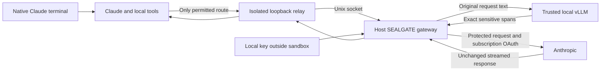

# Native Claude with an inspected outbound gateway

`sealgate claude` runs the installed native Claude Code binary inside a Linux Docker
sandbox. You use Claude's normal terminal interface and permission dialogs.
Before an inference request leaves the machine, a host-side gateway inspects its
complete JSON body with the configured trusted detector and encrypts sensitive
text locally. The binary is mounted read-only; SEALGATE does not patch it.



## Start

Requires Linux ARM64 or x86-64, Node.js 22+, a local Docker daemon with seccomp,
and the native Linux `claude` binary on PATH. Docker builds a small runtime with
Node, Bash, Git and ripgrep. It mounts your installed Claude binary into that
runtime; it does not download or redistribute Claude.

After initializing SEALGATE and configuring the trusted provider in a private `.env`:

```sh
npm ci
sealgate sandbox-build
claude auth login
sealgate claude
```

Use `sealgate claude --model MODEL` to select a Claude model. For a single prompt from
stdin, use `sealgate claude --print < prompt.txt`. Prompts are never accepted as CLI
arguments. The detector model and endpoint still come from your existing SEALGATE
configuration and `.env`; decryption remains an explicit offline `sealgate decrypt`
operation outside Claude. vLLM detects spans; Node's AES-256-GCM encrypts them.

Run from the project directory you want Claude to edit. It is mounted read-write
at `/workspace`. Normal file edits persist in that directory. Tools use the
container's installed programs, so host-only binaries and paths are unavailable.
The project root `.env` is masked with an empty read-only file, and the encryption
key directory is never mounted. Host environment variables are not forwarded.
Do not put copies of your SEALGATE key or detector credential elsewhere in the project.

The native interface keeps normal tool approval behavior. User-level hooks,
plugins, settings, and MCP configuration are not imported from your host home.
Project and local Claude settings still load. MCP configuration is disabled by
the launcher. The temporary Claude home contains a copy of your subscription
login and minimal account/onboarding state. It is removed on normal exit; there
is no cross-launch conversation persistence in this version. A forced host crash
can leave private `sealgate-run-*` directories under the OS temporary directory.

## Subscription authentication

SEALGATE sets `ANTHROPIC_BASE_URL` and preserves the saved claude.ai OAuth login. It
does not set `ANTHROPIC_API_KEY`, `ANTHROPIC_AUTH_TOKEN`, or `apiKeyHelper`.
The gateway pins the current access token for the launch, requires that exact
Authorization value on each model request, and forwards it unchanged along with
`anthropic-version` and the complete `anthropic-beta` header. It accepts no
API-key authentication. Your existing subscription usage limits still apply.

This behavior is explicitly described in Claude's
[subscriptions and gateways documentation](https://code.claude.com/docs/en/llm-gateway#subscriptions-and-gateways).
Authentication headers are an intentional exception to content encryption:
Anthropic must receive its own OAuth credential, and the detector never sees it.

Login and token refresh are performed **outside** the sandbox with `claude auth
login`. An expired saved token stops launch. If it expires during a session, exit,
sign in again and relaunch. OAuth browser flows and refresh endpoints are not
general-purpose routes through SEALGATE. This version reads Linux's private
`.claude/.credentials.json`, including a custom `CLAUDE_CONFIG_DIR`; it does not
extract credentials from macOS Keychain or support cloud-provider authentication.

## What is inspected

The gateway supports `POST /v1/messages` and `POST /v1/messages/count_tokens`,
with an optional exact `?beta=true` query. Every supported request is fully
buffered before any upstream connection is made. Text inspection covers:

- System text, typed prompts, all message roles, and earlier conversation text.
- File contents and tool results represented as text content blocks.
- Tool input values, descriptions, schemas, nested string values and metadata.
- Object keys, numeric values, protocol strings and forwarded capability headers.

The detector receives decoded field text separated by unique field boundaries.
Exact matching therefore preserves Unicode and multiline text without JSON
escaping ambiguity. Every occurrence is replaced and overlapping matches merge.
If a detected span crosses fields or occurs in a field that cannot be safely
changed, such as a tool name, model, object key or number, the whole request is
blocked. Unknown top-level request fields and unsupported content blocks are
blocked for explicit compatibility review when Claude's protocol changes.

New AES-GCM ciphertext uses a random nonce. Repeated sensitive values within the
same gateway session reuse their first ciphertext, avoiding changing all history
on every request. This leaks equality within that session. The bounded memory
cache stores keyed hashes and ciphertext, not plaintext. Detection still runs on
every request; it is not skipped on a cache hit. Existing markers are accepted
only when issued by that running gateway. Markers from earlier launches, manual
`sealgate protect`, or unknown keys are rejected; the gateway never decrypts them.

Signed thinking and redacted-thinking blocks need exact bytes for Anthropic's
signature checks. SEALGATE records hashes of complete signed blocks observed in
upstream responses and permits only exact replays from that session. Their
cache-control metadata is inspected separately. New or altered signed blocks,
images, opaque documents, base64 uploads, remote file references and unsupported
API endpoints are blocked. Remote content already known to Anthropic is not a
new disclosure of local text. See the official
[gateway protocol guide](https://code.claude.com/docs/en/llm-gateway-protocol).

Unused client headers are discarded, including custom headers and local machine
identifiers. The gateway supplies fixed transport headers and never logs request
bodies, provider responses or credentials. It streams upstream responses and
errors without rewriting their bodies, including SSE pings, and does not decrypt
replies or tool arguments. Encrypted paths or tool arguments can consequently
make a tool operation impossible; use synthetic values for tasks that require
interpreting hidden data.

## Network enforcement and limits

The relay starts with Docker's `none` network. Claude joins that network namespace
but has separate filesystem/process isolation and a stricter seccomp profile.
Only the relay can open the host gateway socket; it has no external network
itself. Claude and its child processes cannot create Unix sockets, including
sockets a project exposes to host services. Direct Internet, host-loopback, DNS,
Docker-daemon, telemetry, updates, remote MCP, browser integration, WebFetch and
remote-control traffic do not get a bypass. They fail or remain unavailable.
Only model requests accepted and transformed by the gateway are forwarded.

This is intentionally a restricted network environment, not a transparent proxy
for arbitrary HTTPS services. A future endpoint must receive an explicit policy
before it can be used. There is no CONNECT tunnel, generic forward proxy,
redirect following, or fallback that sends original text. If Docker isolation
cannot start, the launcher exits rather than running Claude on the host.
Docker's [none network](https://docs.docker.com/engine/network/drivers/none/) and
[seccomp documentation](https://docs.docker.com/engine/security/seccomp/) describe
the underlying controls. The included policy and attribution are in
[sandbox/](../sandbox/README.md).

Limits are 2 MiB per incoming JSON body, 1 MiB of aggregated detection text,
100,000 JSON nodes, depth 64, two active requests, and a ten-minute total request
timeout. Provider timeout settings still apply inside that deadline. Responses
are capped at 32 MiB and signed blocks/events at 2 MiB. Large codebases or tool
schemas may exceed these limits. A local detector can also add substantial
latency because system context and tools are inspected on each turn.
For Qwen served by vLLM, the optional `.env` setting `SEALGATE_ENABLE_THINKING=false`
can reduce this latency; it changes only the detector's chat template, not
Claude's reasoning. Test detection quality for your data when changing this mode.

Complete interception does **not** mean complete secret detection. The trusted
LLM can miss text, including encoded secrets or adversarial instructions. Numeric
data and protocol matches cause blocking, not a stronger detection guarantee.
The host detector process, Docker daemon, kernel, terminal and project execution
environment must be trusted. Files are intentionally writable: this does not
stop a tool from changing a script that you later execute outside the sandbox.
Local Claude sees original text and may keep it in its temporary session files.
This feature protects outbound model requests, not local plaintext at rest or
covert channels through a compromised host.

## Verification

```sh
npm test
sealgate sandbox-build
npm run test:sandbox
```

The normal suite uses mock vLLM and Anthropic services and needs no subscription.
The explicit sandbox suite starts disposable containers, tests direct TCP/DNS
and Unix-socket escape attempts, checks hidden credentials and persistent file
edits, and runs the installed native Claude binary against a mock Anthropic SSE
service. It checks prompt, CLAUDE.md and Read-tool-result protection. Set
`SEALGATE_TEST_CLAUDE=/absolute/path/to/claude` if the native binary is not under
`~/.local/bin`. These tests use synthetic OAuth credentials.

A live subscription smoke test additionally needs a current login. Passing mock
tests verifies transport and interception; it does not prove a specific account
currently has service access or that all future Claude versions are compatible.

To exercise native Claude and your configured live vLLM together against the mock
remote service, run `SEALGATE_TEST_LIVE=1 npm run test:sandbox`. Only synthetic fixture
text is used; this loads your existing private SEALGATE detector configuration. It
can take several minutes and still requires no live Anthropic subscription.
