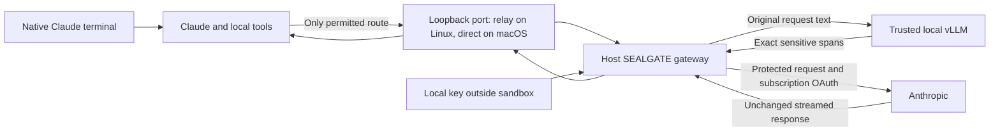

# Native Claude with an inspected outbound gateway

`sealgate claude` runs the installed native Claude Code binary inside an OS
sandbox: the macOS sandbox (Seatbelt, applied with `sandbox-exec`) or a Linux
Docker sandbox. You use Claude's normal terminal interface and permission dialogs.
Before an inference request leaves the machine, a host-side gateway inspects its
complete JSON body with the configured trusted detector and encrypts sensitive
text locally. The binary is mounted read-only; SEALGATE does not patch it.



## Start

Requires Node.js 22+ and the native `claude` binary on PATH, plus either macOS
ARM64/x86-64 (the built-in `sandbox-exec` is used; nothing to build) or Linux
ARM64/x86-64 with a local Docker daemon with seccomp. On Linux, Docker builds a
small runtime with Node, Bash, Git and ripgrep and mounts your installed Claude
binary into it; SEALGATE does not download or redistribute Claude.

After initializing SEALGATE and configuring the trusted provider in a private `.env`:

```sh
npm ci
sealgate sandbox-build   # Linux only
claude auth login
sealgate claude
```

Use `sealgate claude --model MODEL` to select a Claude model. For a single prompt from
stdin, use `sealgate claude --print < prompt.txt`. Prompts are never accepted as CLI
arguments. `--proxy-egress` is described under HTTP proxies below. The detector
model and endpoint still come from your existing SEALGATE configuration and
`.env`; decryption remains an explicit offline `sealgate decrypt` operation
outside Claude. vLLM detects spans; Node's AES-256-GCM encrypts them.

Run from the project directory you want Claude to edit; it is writable and edits
persist. On macOS the project keeps its real path, system directories and
Homebrew are readable, and your home directory, `/Users`, `/Volumes` and the
per-user temporary tree are hidden except the project, the Claude binary and
the read-only `sandboxReadPaths` from `config.json`. On Linux the project is
mounted at `/workspace` and tools use the container's programs. On both, the
root `.env` is hidden (Linux masks it with an empty file; macOS denies reads,
so tools see a permission error), the key directory is never exposed, and host
environment variables are not forwarded. Do not put copies of your SEALGATE key
or detector credential elsewhere in the project.

The native interface keeps normal tool approval behavior. User-level hooks,
plugins, settings, and MCP configuration are not imported from your host home.
Project and local Claude settings still load. MCP configuration is disabled by
the launcher. The temporary Claude home contains a copy of your subscription
login and minimal account/onboarding state. It is removed on normal exit; there
is no cross-launch conversation persistence in this version. A forced host crash
can leave private `sealgate-run-*` directories under the OS temporary directory.

## Subscription authentication

SEALGATE sets `ANTHROPIC_BASE_URL` and preserves the saved claude.ai OAuth login. It
does not set `ANTHROPIC_API_KEY`, `ANTHROPIC_AUTH_TOKEN`, or `apiKeyHelper`.
The gateway pins the current access token for the launch, requires that exact
Authorization value on each model request, and forwards it unchanged along with
`anthropic-version` and the complete `anthropic-beta` header. It accepts no
API-key authentication. Your existing subscription usage limits still apply.

This behavior is explicitly described in Claude's
[subscriptions and gateways documentation](https://code.claude.com/docs/en/llm-gateway#subscriptions-and-gateways).
Authentication headers are an intentional exception to content encryption:
Anthropic must receive its own OAuth credential, and the detector never sees it.

Login and token refresh are performed **outside** the sandbox with `claude auth
login`. An expired saved token stops launch. If it expires during a session, exit,
sign in again and relaunch. OAuth browser flows and refresh endpoints are not
general-purpose routes through SEALGATE. The login is read from the private
`.claude/.credentials.json` file when it exists (including a custom
`CLAUDE_CONFIG_DIR`), otherwise on macOS from the default Keychain item
`Claude Code-credentials` through the `security` tool. A copy is placed in the
temporary Claude home and `CLAUDE_CONFIG_DIR` points there, so the sandboxed
Claude uses the file and never touches your real Keychain entry, which the
profile also denies. Cloud-provider authentication is not supported.

## What is inspected

The gateway supports `POST /v1/messages` and `POST /v1/messages/count_tokens`,
with an optional exact `?beta=true` query. Every supported request is fully
buffered before any upstream connection is made. Text inspection covers:

- System text, typed prompts, all message roles, and earlier conversation text.
- File contents and tool results represented as text content blocks.
- Tool input values, descriptions, schemas, nested string values and metadata.
- Object keys, numeric values, protocol strings and forwarded capability headers.

The detector receives decoded field text separated by unique field boundaries.
Exact matching therefore preserves Unicode and multiline text without JSON
escaping ambiguity. Every occurrence is replaced and overlapping matches merge.
If a detected span crosses fields or occurs in a field that cannot be safely
changed, such as a tool name, model, object key or number, the whole request is
blocked. Unknown top-level request fields and unsupported content blocks are
blocked for explicit compatibility review when Claude's protocol changes.

New AES-GCM ciphertext uses a random nonce. Repeated sensitive values within the
same gateway session reuse their first ciphertext, avoiding changing all history
on every request. This leaks equality within that session. The bounded memory
cache stores keyed hashes and ciphertext, not plaintext. Detection still runs on
every request; it is not skipped on a cache hit. Existing markers are accepted
only when issued by that running gateway. Markers from earlier launches, manual
`sealgate protect`, or unknown keys are rejected; the gateway never decrypts them.

Signed thinking and redacted-thinking blocks need exact bytes for Anthropic's
signature checks. SEALGATE records hashes of complete signed blocks observed in
upstream responses and permits only exact replays from that session. Their
cache-control metadata is inspected separately. New or altered signed blocks,
images, opaque documents, base64 uploads, remote file references and unsupported
API endpoints are blocked. Remote content already known to Anthropic is not a
new disclosure of local text. See the official
[gateway protocol guide](https://code.claude.com/docs/en/llm-gateway-protocol).

Unused client headers are discarded, including custom headers and local machine
identifiers. The gateway supplies fixed transport headers and never logs request
bodies, provider responses or credentials. It streams upstream responses and
errors without rewriting their bodies, including SSE pings, and does not decrypt
replies or tool arguments. Encrypted paths or tool arguments can consequently
make a tool operation impossible; use synthetic values for tasks that require
interpreting hidden data.

## Network enforcement and limits

### macOS

On macOS there is no relay: the gateway listens on a random loopback port and the
Seatbelt profile in [`sandbox/profile.sb`](../sandbox/profile.sb) permits outbound
connections to that port only. The profile is deny-by-default and modeled on the
allowlist Claude Code's own sandbox runtime uses. DNS, other loopback ports, Unix
sockets, listening sockets, the Keychain, LaunchServices (`open`), Apple Events,
`launchctl` job submission, Spotlight and the clipboard are denied; setuid
programs such as `ps` and `sudo` cannot start under any Seatbelt profile. Host
paths reach the profile only as `sandbox-exec -D` parameters, never by string
interpolation. See [sandbox/macos.md](../sandbox/macos.md) for the rationale.

This provides less process and IPC isolation than Docker: the sandbox shares the host kernel and
Mach IPC namespace, so a kernel or sandbox bug is a full escape, and Apple has
deprecated `sandbox-exec` while continuing to ship it. If it is missing, the
launcher exits rather than running Claude unconfined. Claude Code's built-in
Bash sandbox cannot start inside SEALGATE (nested profiles are refused), local
development servers cannot listen, Claude's process-listing features degrade
because `ps` is unavailable, and the pseudo-terminal write rule needed for child
processes also covers your other terminals.

### Linux

The relay starts with Docker's `bridge` network. Claude joins that network namespace
but has separate filesystem/process isolation and a stricter seccomp profile.
Only the relay can open the host gateway socket. Claude and its child processes
cannot create Unix sockets, including sockets a project exposes to host services.
Tools have direct outbound TCP and DNS access by default, so downloads and other
network calls bypass SEALGATE's inspection and encryption. `--proxy-egress` is
optional. Host loopback remains separate; host services reachable through the
bridge can be contacted. Relay ports bind only to the container's loopback and
are not published on the host.

`ANTHROPIC_BASE_URL` directs Claude's model requests to the inspecting gateway.
Before Claude starts, a temporary helper installs nftables rules that reject
traffic to the original provider, `api.anthropic.com`, at all resolved IPv4 and
IPv6 addresses on every port and protocol. Only this helper receives `NET_ADMIN`;
the client and relay cannot change the rules. The rules apply inside their shared
network namespace, so the host gateway can still reach Anthropic after inspection.
The client receives a read-only hosts file pinned to the blocked addresses.
Every 30 seconds, the host resolves the provider again and atomically refreshes
the firewall, retaining previous addresses. DNS or firewall refresh failures
stop the client. Rebuild the image with `sealgate sandbox-build` after upgrading.

This is a destination block for the supported Anthropic upstream. Other tool
destinations remain available and uninspected. Arbitrary third-party relays,
alternate provider endpoints, and addresses obtained from a different resolver
before the next refresh are outside this block; it is not a universal boundary
against covert model traffic over otherwise allowed tool connections.
The gateway still rejects unsupported requests and never falls back to forwarding
original text after a protection failure. Telemetry, auto-updates and cloud MCP
remain disabled by the launcher configuration. If isolation cannot start, the
launcher exits rather than running Claude on the host.

### HTTP proxies

The gateway reaches Anthropic through the `HTTPS_PROXY` (or `HTTP_PROXY` for a
plain-HTTP loopback test upstream) from the host environment using an HTTP
CONNECT tunnel that SEALGATE implements itself; Node's `fetch` is not used. The
proxy must be `http://host:port`, optionally with credentials; `NO_PROXY`
entries and loopback targets connect directly. The same rule applies to a
remote detector. With `--proxy-egress`, the host also runs a
forwarder from a loopback port (macOS) or the relay's port 17841 (Linux) to that
proxy, and the sandbox environment points `HTTPS_PROXY`/`HTTP_PROXY` at it while
`NO_PROXY` keeps model requests on the gateway. On Linux, the forwarder checks
every HTTP request and CONNECT destination, rejecting the original provider's
hostname, known IP addresses, and DNS aliases that resolve to those IPs. Invalid
or unresolved destinations are denied. The host proxy receives reconstructed
authorities so a conflicting Host header cannot bypass the check. Allowed
traffic is not inspected or encrypted by SEALGATE. macOS retains its byte-level
forwarder. Proxy credentials stay in the host forwarder on Linux.
On Linux, direct tool networking remains available with or without this flag.
Docker's [bridge network](https://docs.docker.com/engine/network/drivers/bridge/) and
[seccomp documentation](https://docs.docker.com/engine/security/seccomp/) describe
the underlying controls. The included policy and attribution are in
[sandbox/](../sandbox/README.md).

Limits are 2 MiB per incoming JSON body, 1 MiB of aggregated detection text,
100,000 JSON nodes, depth 64, two active requests, and a ten-minute total request
timeout. Provider timeout settings still apply inside that deadline. Responses
are capped at 32 MiB and signed blocks/events at 2 MiB. Large codebases or tool
schemas may exceed these limits. A local detector can also add substantial
latency because system context and tools are inspected on each turn.
For Qwen served by vLLM, the optional `.env` setting `SEALGATE_ENABLE_THINKING=false`
can reduce this latency; it changes only the detector's chat template, not
Claude's reasoning. Test detection quality for your data when changing this mode.

Complete interception does **not** mean complete secret detection. The trusted
LLM can miss text, including encoded secrets or adversarial instructions. Numeric
data and protocol matches cause blocking, not a stronger detection guarantee.
The host detector process, Docker daemon, kernel, terminal and project execution
environment must be trusted. Files are intentionally writable: this does not
stop a tool from changing a script that you later execute outside the sandbox.
Local Claude sees original text and may keep it in its temporary session files.
This feature protects outbound model requests, not local plaintext at rest or
covert channels through a compromised host.

## Verification

```sh
npm test
npm run test:seatbelt          # macOS
sealgate sandbox-build && npm run test:sandbox   # Linux
```

The normal suite uses mock vLLM and Anthropic services and needs no subscription.
The Linux suite verifies direct tool TCP/DNS access with and without the proxy,
provider TCP/UDP and IPv4/IPv6 denial, read-only DNS pinning, firewall tamper
denial, address refresh, session termination on DNS failure, gateway protection,
and Unix-socket denial using local fixtures. Native Claude runs both Read and a
networked Bash tool; their results are protected on the next model request. The macOS suite
tests network, Keychain, `open`, Apple Events, `launchctl` and clipboard escape
attempts. The platform suites check
hidden credentials, opt-in read paths, the proxy forwarder and persistent file
edits, and run the installed native Claude binary against a mock Anthropic SSE
service. They check prompt, CLAUDE.md and Read-tool-result protection. Set
`SEALGATE_TEST_CLAUDE=/absolute/path/to/claude` if the native binary is not under
`~/.local/bin`. These tests use synthetic OAuth credentials. While changing the
macOS profile, watch denials with
`/usr/bin/log stream --style compact --predicate 'sender == "Sandbox"'`.

A live subscription smoke test additionally needs a current login. Passing mock
tests verifies transport and interception; it does not prove a specific account
currently has service access or that all future Claude versions are compatible.

To exercise native Claude and your configured live vLLM together against the mock
remote service, run `SEALGATE_TEST_LIVE=1 npm run test:sandbox` (Linux) or
`SEALGATE_TEST_LIVE=1 npm run test:seatbelt` (macOS). Only synthetic fixture
text is used; this loads your existing private SEALGATE detector configuration. It
can take several minutes and still requires no live Anthropic subscription.
